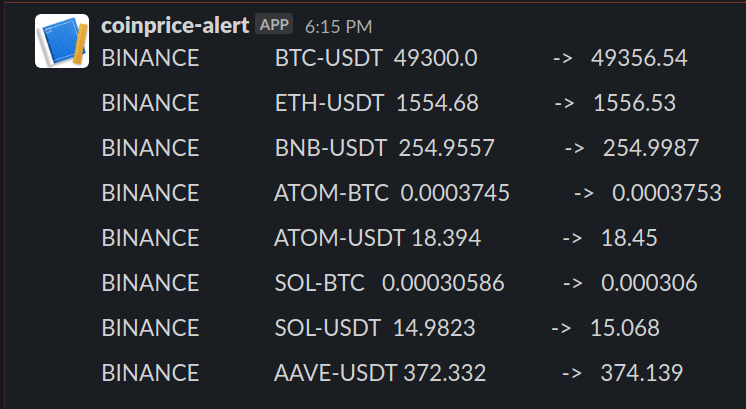

# Coinprice-Alert Slack Bot
[](https://ko-fi.com/X8X71S1S7)

[comment]: <> (<p align="center">)

[comment]: <> (    )

[comment]: <> (</p>)


A cron job to send Slack messages with ATH price alerts.


## Requirements:
- Heroku account
- Heroku CLI
- git 
- Slack workspace with admin privilege
- Firebase

## Deploying to Heroku
- Create a slack custom integration if you have not already
```bash
git clone git@github.com:mochahub/coinprice-alert.git
cd coinprice-alert
```
- Create a heroku project (skip if its already set up)
```bash
heroku login
heroku create
git push heroku master
```
- Setup Firebase 
    - Create a firebase project at https://firebase.google.com/
    - Create a database
    - Download a private key from settings -> Service Accounts
    - Rename this file to firestore-admin.json
- Setup Environment Variables:
- These can also be configured on the web client for heroku
```bash
# Mandatory
heroku config:set SLACK_WEBHOOK="{slack incoming web hook}"
```
- `FIRESTORE_ADMIN` environment variable needs to be manually updated in the heroku UI with the contents of `firestore-admin.json`
- Verify that the script works
```bash
heroku run python3 ./__main__.py
```
- Install and configure the scheduler via the CLI
- configure frequency as desired
```bash
heroku addons:create scheduler:standard
heroku addons:open scheduler
# Under Run Command: python3 ./__main__.py
```

[comment]: <> (- Setup Firebase)

[comment]: <> (  - Create a firebase project at `https://firebase.google.com/`)

[comment]: <> (  - Create a database)

[comment]: <> (  - Download a private key from `settings -> Service Accounts`)

[comment]: <> (  - Rename this file to `firestore-admin.json`)

[comment]: <> (- Add Firebase Admin Cred to Heroku)

[comment]: <> (  - On the web heroku client, paste in the contents of `firestore-admin.json` into a config var &#40;environment variable&#41; called `firestoreAdmin`)

[comment]: <> (  - Should see a slack message)
